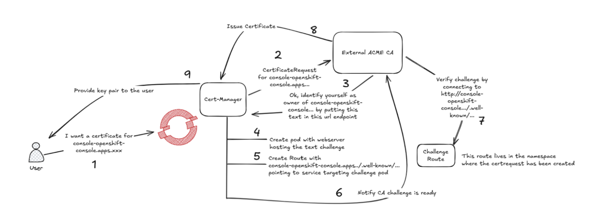

# HTTP01 Challenge Proxy for Cert Manager

## Summary

For baremetal platforms only.  Provide a way for cert-manager to complete http01 challenges against API endpoints (such as api.cluster.example.com) similar to the way it handles certificate challenges for other OpenShift Ingress endpoints.

## Motivation

Cert manager can be used to issue certificates for the OpenShift Container Platform (OCP) endpoints (e.g., console, downloads, oauth) using an external ACME Certificate Authority (CA). These endpoints are exposed via the OpenShift Ingress (`*.apps.cluster.example.com`), and this is a supported and functional configuration today.

However, cluster administrators often want to use Cert Manager to issue custom certificates for the API endpoint (`api.cluster.example.com`). Unlike other endpoints, this API endpoint is not exposed via the OpenShift Ingress. Depending on the OCP topology (e.g., SNO, MNO, Compact), it is exposed directly on the node or via a keepalive VIP. This lack of management by the OpenShift Ingress introduces challenges in obtaining certificates using an external ACME CA.

The gap arises due to how the ACME HTTP01 challenge works. The following scenarios illustrate the challenges:

1. **Standard Clusters**: The API VIP is hosted on the control plane nodes which do not host an OpenShift Router. The http01 challenge, which is directed at the API VIP (the IP where `api.cluster.example.com` DNS resolves), will not hit an OpenShift Router and thus not reach the challenge response pod started by Cert Manager.
2. **Compact Clusters**: The node hosting the API VIP may also host an OpenShift Router. If no router is present on the node hosting the VIP, the challenge will fail.
3. **SNO (Single Node OpenShift)**: The same nodes host both the ingress and API components. Both FQDNs (`api` and wildcard) resolve to the same IP, making the challenge feasible.

To address this gap, a small proxy was developed. This proxy runs on the cluster as a DaemonSet (control plane nodes) and ensures that connections reaching the API on port 80 are redirected to the OpenShift Ingress Routers. The proxy implementation creates a reverse proxy to the apps VIP and uses `nftables` to redirect traffic from `API:80` to `PROXY:8888`.

- **Proxy Code**: [GitHub Repository](https://github.com/mvazquezc/cert-mgr-http01-proxy/tree/main)
- **Deployment Manifest**: [Manifest Link](https://github.com/mvazquezc/cert-mgr-http01-proxy/blob/main/manifests/deploy-in-ocp.yaml)

This enhancement aims to provide a robust solution for managing certificates for the API endpoint in baremetal environments.

### User Stories

1. **As a cluster administrator**, I want to manage custom certificates for the API endpoint (`api.cluster.example.com`) using an external ACME CA, so that I can ensure secure communication for my cluster's API.
2. **As a cluster administrator on a baremetal platform**, I want a reliable solution to handle HTTP01 challenges for the API endpoint, even when the endpoint is not managed by OpenShift Ingress, so that I can avoid manual workarounds.
3. **As a developer**, I want a simple deployment mechanism for the HTTP01 challenge proxy, so that I can easily integrate it into my existing cluster setup.

### Proposal

The HTTP01 Challenge Proxy will be implemented via DaemonSet running on the cluster. It will:

- Redirect HTTP traffic from the API endpoint (`api.cluster.example.com`) on port 80 to the OpenShift Ingress Routers.
- Use `nftables` for traffic redirection from `API:80` to `PROXY:8888`.
- Be deployed using a manifest that includes all necessary configurations.

The proxy will ensure compatibility with various OCP topologies, including SNO, MNO, and Compact clusters, addressing the challenges of HTTP01 validation for the API endpoint.

### API Extensions

A new CR type may be created and can be applied to clusters.  This new typed will be stored in the [openshift/api](https://github.com/openshift/api) repo.

### Implementation Details/Notes/Constraints

- The proxy will be deployed as a DaemonSet to ensure it runs on all nodes which may host the API VIP in the cluster.
- The nftables rules will be added to the nodes. The proxy will listen on port 8888 and redirect traffic to the OpenShift Ingress Routers.
- The implementation relies on `nftables` for traffic redirection, which must be supported and enabled on the cluster nodes.
- The demo deployment manifest for the proxy is available [here](https://github.com/mvazquezc/cert-mgr-http01-proxy/blob/main/manifests/deploy-in-ocp.yaml).
- An example implementation can be found in this [repository](https://github.com/mvazquezc/cert-mgr-http01-proxy/tree/main).

### Design Details

- **Proxy Deployment**: The proxy will be deployed using a Kubernetes DaemonSet. The daemonset will implement an nftable rule via pod that runs to completion.
- **Traffic Redirection**: This will use `nftables` rules to redirect incoming traffic on `API:80` to `PROXY:8888`.
- **Security**: The proxy will only handle HTTP traffic for the HTTP01 challenge and will not interfere with other traffic or services.
- **Monitoring**: Logs and metrics will be exposed to help administrators monitor the proxy's behavior and troubleshoot issues.

### Drawbacks

1. **Dependency on nftables**: The solution relies on `nftables`, which may not be available or enabled on all environments.
2. **Additional Resource Usage**: Running the proxy as a DaemonSet introduces additional resource usage on the cluster nodes while the proxy pod is applying its nftable rules.
3. **Complexity**: The solution adds another component to the cluster, which may increase operational complexity.

### Alternatives

None

### Risks and Mitigations

1. **Proxy Failure**: If the proxy fails, HTTP01 challenges for the API endpoint will not succeed. Mitigation: Use health checks and monitoring to ensure the proxy is running correctly.
2. **Traffic Interference**: The proxy could inadvertently interfere with other traffic. Mitigation: Carefully scope the proxy's functionality to only handle HTTP01 challenge traffic.

### Implementation History

- **2025-03-28**: Enhancement proposal created.

### References

- [Cert Manager Expansion JIRA Epic](https://issues.redhat.com/browse/CNF-13731)
- [ACME HTTP01 Challenge](https://letsencrypt.org/docs/challenge-types/#http-01-challenge)
- [Proxy Code Repository](https://github.com/mvazquezc/cert-mgr-http01-proxy/tree/main)
- [Deployment Manifest](https://github.com/mvazquezc/cert-mgr-http01-proxy/blob/main/manifests/deploy-in-ocp.yaml)

